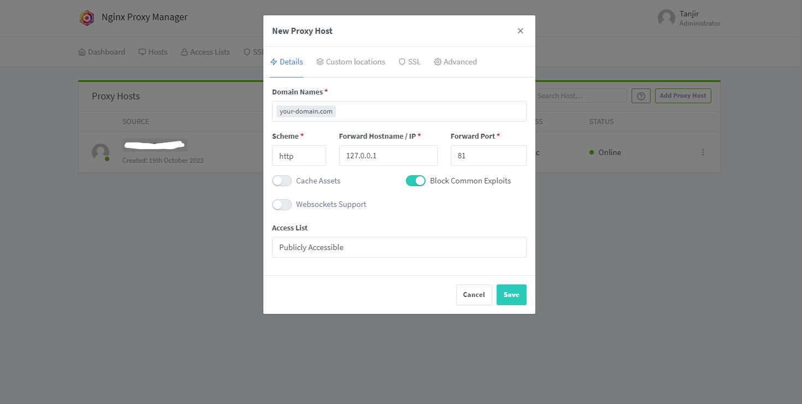

Nginx Proxy Manager is a web-based tool that simplifies the management of virtual hosts and reverse proxies in Nginx. <!--more-->Using this tool can save a lot of time and effort, additionally it let's you install custom SSL or LetsEncrypt certificate directly from the web interface.

#### Before moving on
- Check if port 81 is open in your firewall
- Stop the nginx server (if any installed)

SSH into your server and enter the following commands

mkdir nginx-proxy-manager && cd nginx-proxy-manager
sudo nano docker-compose.yml


and paste this configuration into the `docker-compose.yml` file

```bash
version: "3"
services:
  app:
    container_name: "nginx-proxy-manager"
    image: "jc21/nginx-proxy-manager:latest"
    restart: unless-stopped
    network_mode: "host"
    volumes:
      - ./data:/data
      - ./letsencrypt:/etc/letsencrypt
```

Start the container in detach mode

docker-compose up -d


Now go to this url: `http://your_server_ip_address:81` Login with the default credentials.

```
Email address: admin@example.com
Password: changeme
```

This is how your basic configuration will look like. Feel free to setup your custom domain for Nginx Proxy Manager.



<style>
.canon { background: white; width: 100%; height: auto;}
</style>



```

```
