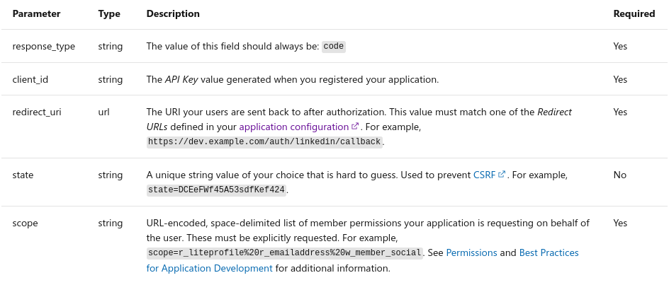

Implementation of LinkedIn login in your application is pretty straight forward. There are a few solutions out there. Some are using passport.js which I very much dislike since it loads a lots of unwanted modules you don't need and it is intended for the use of Express.js based frameworks which uses middleware approach. If you use some other frameworks then it will not be of much help.

I will follow a more simplistic approach in this article following the [Documentation](https://docs.microsoft.com/en-us/linkedin/).

Before you dive into coding you need to create a [developer account](https://www.linkedin.com/developers/apps/new). After creating your app. Go to **Products** section and select **Sign In with LinkedIn** from the **Additional available products** section. This might take a while before you can use.

LinkedIn follows OAuth2.0 protocols to authorize third party application. I'm not going into the depth of how OAuth protocol works. Maybe some other day I'll post a brief article about how OAuth Framework works under the hood. You can follow the [reference](https://oauth.net/2/) for further inquiries.

For the authorization flow to work you need to follow these steps below. These are the common steps for all applications using OAuth2.0 protocol.

1. [Configure Your Application](https://docs.microsoft.com/en-us/linkedin/shared/authentication/authorization-code-flow?context=linkedin%2Fconsumer%2Fcontext&tabs=HTTPS#step-1-configure-your-application)
2. [Request an Authorization Code](https://docs.microsoft.com/en-us/linkedin/shared/authentication/authorization-code-flow?context=linkedin%2Fconsumer%2Fcontext&tabs=HTTPS#step-2-request-an-authorization-code)
3. [Exchange Authorization Code for an Access Token](https://docs.microsoft.com/en-us/linkedin/shared/authentication/authorization-code-flow?context=linkedin%2Fconsumer%2Fcontext&tabs=HTTPS#step-3-exchange-authorization-code-for-an-access-token)
4. [Make Authenticated Requests](https://docs.microsoft.com/en-us/linkedin/shared/authentication/authorization-code-flow?context=linkedin%2Fconsumer%2Fcontext&tabs=HTTPS#step-4-make-authenticated-requests)

Hopefully you are able to create you application from the developer console. Lets see how we can request an Authorization Code. We'll request for an Authorization Code to LinkedIn server using the below endpoint.

```
GET https://www.linkedin.com/oauth/v2/authorization
```



<p>We'll be requesting for user's profile and email for our the users to login to our application. For this to work we need to set the above parameters on the endpoints. They are pretty much explained in the image. You need to add a <code>redirect_uri</code> in the developer console in the <strong>Auth</strong> section under <strong>OAuth 2.0 settings.</strong> This is where the user will be redirected to on your client application.</p>

Your final endpoint will look similar to this.

```
GET https://www.linkedin.com/oauth/v2/authorization?response_type=code&client_id={your_client_id}&redirect_uri={your_callback_url}&state=foobar&scope=r_liteprofile%20r_emailaddress%20w_member_social
```

All right now lets make our social button work. I'm going to use a create-react-app for demonstration, but the process will be the same for other frameworks/libraries.

```javascript
const linkedin_client_id = "yourclientid";
const redirect_uri = "http://localhost:3000";

function App() {
	return (
		<a
			className="w-6/12 block"
			href={`https://www.linkedin.com/oauth/v2/authorization?response_type=code&client_id=${linkedin_client_id}&redirect_uri=${redirect_uri}/auth/linkedin&state=987654321&scope=r_liteprofile%20r_emailaddress`}
		>
			
		</a>
	);
}

export default App;
```

This will redirect the user to login page of LinkedIn. After the user login you will receive a authorization code in the query parameter of the url like below.

```
http://example.com/auth/linkedin?code=AQTFMKgaINDK6s46giqFXJIQ9M97FmYTC67teZDYtsJ_MYr2HhjdE3JQqzXEdWpAQTYKoOR9FOyd83QdGqFDL6TkBHtXarJl23cCUdZeSKpG4G9vJezswEDA9xcyotUCrDndzKOAY5Njt2fX8-rDMEdkumxwtQ_ecusjhwwgblFGrzbAEFCZiiOoHycQfn5aXErbBZ_Np9pPkPgxJuM&state=987654321
```

I'm going to use query-sting library to parse the code from url, however you can do it in a different way.

```bash
npm i query-string
```

We'll use the code to request an access-token which we'll need for the subsequent requests. I am going to use Express.js as an example for our back-end api.

```javascript
const express = require("express");
const bodyParser = require("body-parser");
const cors = require("cors");
const app = express();
const axios = require("axios");
const port = 4000;

// parse application/x-www-form-urlencoded
app.use(bodyParser.urlencoded({ extended: false }));

// parse application/json
app.use(bodyParser.json());
app.use(cors());
app.options("*", cors());

app.get("/", (req, res) => {
	res.send("Hello World!");
});

app.post("/auth/users/linkedin/access-token", async (req, res) => {
	try {
		const { code } = request.body;
		const data = await axios
			.post("https://www.linkedin.com/oauth/v2/accessToken", null, {
				params: {
					grant_type: "authorization_code",
					code: code,
					redirect_uri: `http://localhost:3000/auth/linkedin`,
					client_id: "yourclientid", // store your client_id and client_secret in a secret manager or environment valiable file
					client_secret: "yourclientsecret",
				},
			})
			.then((response) => response.data)
			.catch((error) => console.log(error.toString()));

		return res.status(200).json(data);
	} catch (exp) {
		return res.status(400).json({
			error: err.toString(),
		});
	}
});

app.listen(port, () => {
	console.log(`Example app listening at http://localhost:${port}`);
});
```

Make a call to your back-end server to get the accessToken form your client application.

```javascript
import * as queryString from 'query-string';
import { useEffect } from "react"
const linkedin_client_id = "yourclientid"
const redirect_uri = "http://localhost:3000"

function App() {

	useEffect(() => {
		loginWithLinkedIn()
	}, [])

	const loginWithLinkedIn = () => {
		if (typeof window !== "undefined") {
			const urlParams = queryString.parse(window.location.search)

			if (urlParams.error) {
				console.log(`An error occurred: ${urlParams.error}`);
			} else {
				const access_token = await getAccessTokenFromCode(urlParams.code)

			}
		}
	}

	const getAccessTokenFromCode = async (code) => {
		const data = await fetch(`/auth/users/linkedin/access-token`, {
			headers: {
				'Content-Type': 'application/json'
			},
			body: JSON.stringify({ code })
		})
			.then(response => response.json())
			.catch(error => console.log(error.toString()))

		if (data) return data.access_token
		return null
	};

	return (
		<a
			className='w-6/12 block'
			href={`https://www.linkedin.com/oauth/v2/authorization?response_type=code&client_id=${linkedin_client_id}&redirect_uri=${redirect_uri}/auth/linkedin&state=987654321&scope=r_liteprofile%20r_emailaddress`}
		>
			
		</a>
	);
}

export default App;
```

With the accessToken we can get the users email and profile information.

```
GET https://api.linkedin.com/v2/me
```

The above endpoint will give you the following information about users profile in json format.

```json
{
	"id": "REDACTED",
	"firstName": {
		"localized": {
			"en_US": "Tina"
		},
		"preferredLocale": {
			"country": "US",
			"language": "en"
		}
	},
	"lastName": {
		"localized": {
			"en_US": "Belcher"
		},
		"preferredLocale": {
			"country": "US",
			"language": "en"
		}
	},
	"profilePicture": {
		"displayImage": "urn:li:digitalmediaAsset:B54328XZFfe2134zTyq"
	}
}
```

In case you need the users email address, you'll need to make a separate call to this below endpoint.

```
GET https://api.linkedin.com/v2/emailAddress?q=members&projection=(elements*(handle~))
```

You will get the following json response form the endpoint.

```json
{
	"handle": "urn:li:emailAddress:3775708763",
	"handle~": {
		"emailAddress": "hsimpson@linkedin.com"
	}
}
```

The complete source code of your client application will be similar to this regarding any framework/library you use.

```javascript
import * as queryString from "query-string";
import { useEffect } from "react";
const linkedin_client_id = "yourclientid";
const redirect_uri = "http://localhost:3000";

function App() {
	useEffect(() => {
		loginWithLinkedIn();
	}, []);

	const loginWithLinkedIn = async () => {
		if (typeof window !== "undefined") {
			const urlParams = queryString.parse(window.location.search);

			if (urlParams.error) {
				console.log(`An error occurred: ${urlParams.error}`);
			} else {
				const access_token = await getAccessTokenFromCode(
					urlParams.code
				);

				if (access_token) {
					const user = await getLinkedInUserInfo(access_token);
					console.log({ user });
				}
			}
		}
	};

	const getAccessTokenFromCode = async (code) => {
		const data = await fetch(
			`http://localhost:4000/auth/users/linkedin/access-token`,
			{
				headers: {
					"Content-Type": "application/json",
				},
				body: JSON.stringify({ code }),
			}
		)
			.then((response) => response.json())
			.catch((error) => console.log(error.toString()));

		if (data) return data.access_token;
		return null;
	};

	const getLinkedInUserInfo = async (access_token) => {
		const data = await fetch(`http://localhost:4000/auth/users/linkedin`, {
			method: "GET",
			headers: {
				Authorization: access_token,
			},
		})
			.then((response) => response.data)
			.catch((err) => console.log(err.toString()));
		if (data) return data;
		return null;
	};

	return (
		<a
			href={`https://www.linkedin.com/oauth/v2/authorization?response_type=code&client_id=${linkedin_client_id}&redirect_uri=${redirect_uri}/auth/linkedin&state=987654321&scope=r_liteprofile%20r_emailaddress`}
		>
			
		</a>
	);
}

export default App;
```

Add the following endpoint in your back-end application.

```javascript
app.get("/auth/users/linkedin", async (req, res) => {
	try {
		const r_liteprofile = await axios
			.get("https://api.linkedin.com/v2/me", {
				headers: {
					Authorization: `Bearer ${req.headers["Authorization"]}`,
				},
			})
			.then((response) => response.data)
			.catch((error) => console.log(error.toString()));

		const r_emailaddress = await axios
			.get(
				"https://api.linkedin.com/v2/emailAddress?q=members&projection=(elements*(handle~))",
				{
					headers: {
						Authorization: `Bearer ${req.headers["Authorization"]}`,
					},
				}
			)
			.then((response) => response.data)
			.catch((error) => console.log(error.toString()));

		/**
		 * save users data or find an existing user or
		 * sign a JWT token for your saved user to further authenticate to your application
		 * */

		return res.status(200).json({ r_emailaddress, r_liteprofile });
	} catch (exp) {
		return res.status(400).json({
			error: err.toString(),
		});
	}
});
```

If you need to add social login to your application like Google, Twitter, Facebook the process is pretty much the same. In case you need another article just give me ping.
