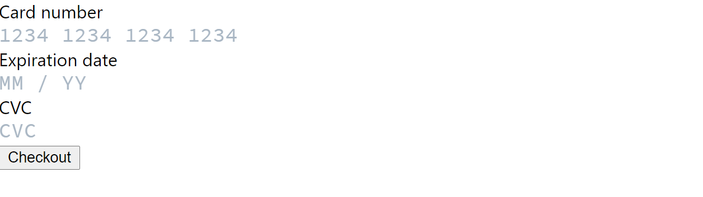

<!-- ## Stripe: Custom Styled Card Elements -->

If you are not satisfied with the pre styled components that Stripe provides then this post is for you.

When we're dealing with credit card payment sometimes we might want the credit card forms to match with our web application's theme so that the user might have a good visual experience. They have a nice example on their [Docs](https://stripe.com/docs/stripe-js/react). We are going to do some form customization today.

If you do not have an account with stripe create one and head over to the [Dashboard](https://dashboard.stripe.com/developers) and go to API keys section to grab your publishable key and secret key. I am not going into depth because the stripe documentation is pretty much simple and I am following the exact server side code from the doc. The main goal of this article to add some cool custom checkout form in the web application rather than using the default form or prebuilt solution.

Let's setup our server with Express.js, stripe library and these following dependencies.

```bash
npm init
npm install express body-parser cors stripe --save
```

##### Create a Paymentintent

Add an endpoint on your server that creates a [PaymentIntent](https://stripe.com/docs/api/payment_intents). A PaymentIntent tracks the customer's payment lifecycle, keeping track of any failed payment attempts and ensuring the customer is only charged once. Return the PaymentIntent's client secret in the response to finish the payment on the client.

```javascript
const express = require("express");
const app = express();
const port = 3001;
const cors = require("cors");
const bodyParser = require("body-parser");

const stripe = require("stripe")("yourapisecret"); // load your api key from .env file

// parse application/x-www-form-urlencoded
app.use(bodyParser.urlencoded({ extended: false }));

// parse application/json
app.use(bodyParser.json());

app.use(cors());
app.options("*", cors());

app.get("/", (req, res) => {
	res.send("Hello World!");
});

app.post("/create-payment-intent", async (req, res) => {
	// const { items } = req.body;
	// Create a PaymentIntent with the order amount and currency
	const paymentIntent = await stripe.paymentIntents.create({
		amount: 10 * 100,
		currency: "usd",
	});
	res.send({
		clientSecret: paymentIntent.client_secret,
	});
});

app.listen(port, () => {
	console.log(`Server running at http://localhost:${port}`);
});
```

That is all you need to do on your server side setup. But it is always a good idea to always verify your amount. Like if you are sending the total amount from your client application please always do a backend check if the amount matches the amount of your cart total.

Instead you can send your shopping cart ID in the backend and fetch the cart total from your database to ensure more safety.

In the client side of our application I will make use of [React Stripe.js](https://github.com/stripe/react-stripe-js).

To get started lets setup a basic create-react-app with the following commands.

```bash
npx create-react-app my-app
cd my-app
npm start
```

Install the the elements library, stripe loader and axios (so that we can make our client application call the Api server).

```bash
npm install --save @stripe/react-stripe-js @stripe/stripe-js axios
```

```javascript
import "./App.css";
import { loadStripe } from "@stripe/stripe-js";
import { Elements } from "@stripe/react-stripe-js";

const stripePromise = loadStripe("yourpublickey");

function App() {
	return <Elements stripe={stripePromise}></Elements>;
}

export default App;
```

Our initial setup of our App.js file looks like this. We loaded the stripe script and passed to our Elements component so that we can use it anywhere in our application.

Create a folder under src/components named CheckoutForm and create three files:

1. CheckoutError.js
2. index.js
3. useResponsiveFontSize.js

You can customize your font size according to your needs depending on how you want to display them on different screen.

In your `src/components/CheckoutComponent/index.js` file paste the bellow snippets.

```javascript
import React, { useMemo, useState } from "react"
import {
    useStripe,
    useElements,
    CardNumberElement,
    CardCvcElement,
    CardExpiryElement
} from "@stripe/react-stripe-js";
import axios from "axios";
import useResponsiveFontSize from "./useResponsiveFontSize";

const useOptions = () => {
    const fontSize = useResponsiveFontSize();
    const options = useMemo(
        () => ({
            style: {
                base: {
                    fontSize,
                    color: "#424770",
                    letterSpacing: "0.025em",
                    fontFamily: "Roboto, Source Code Pro, monospace, SFUIDisplay",
                    "::placeholder": {
                        color: "#aab7c4"
                    }
                },
                invalid: {
                    color: "#9e2146"
                },

            }
        }),
        [fontSize]
    );

    return options;
};

const SplitForm = () => {
    const [isProcessing, setProcessingTo] = useState(false);
    const [checkoutError, setCheckoutError] = useState();

    const stripe = useStripe();
    const elements = useElements();
    const options = useOptions();

    const handleCardDetailsChange = event => {
        event.error ? setCheckoutError(event.error.message) : setCheckoutError();
    };

    const handleSubmit = async (event) => {
        event.preventDefault()
        // our payment process starts here
    }

    return (
        <form onSubmit​={handleSubmit} >
            <label>
                <span>Card number</span>
                <CardNumberElement options={options} onChange​={handleCardDetailsChange} />
            </label>
            <label>
                <span>Expiration date</span>

                <CardExpiryElement options={options} onChange​={handleCardDetailsChange} />
            </label>
            <label>
                <span>CVC</span>
                <CardCvcElement options={options} onChange​={handleCardDetailsChange} />
            </label>

            {/* {!checkoutError && <CheckoutError>{checkoutError}</CheckoutError>} */}
            <button
                type="submit"
                disabled={isProcessing || !stripe}
            >
                Checkout
            </button>
        </form>
    );

}

export default SplitForm;;
```

Now load your browser. You should have a custom checkout form that looks like this which is actually without any styles.



This is not a good looking form since we did not add any styling to the form. We are going to do that after we make the card payment work.

Take a look at the index.js file. It is pretty much self explanatory. At the very top of the file we imported `useStripe`, `useElements`, `CardNumberElement`, `CardCvcElement`, `CardExpiryElement` from stripe library. The useStripe hook is going to be used to initiate the call to stripe server for our payment process to be created. And the rest three are the card elements. Notice, the card elements have a function called `handleCardDetailsChange` for handling any errors occurs during payment like invalid card number or other that stripe sends back in response.

Let's implement our `handleSubmit` function. Add these snippets to the function.

```javascript
const data = await axios
	.post(`http://localhost:3001/create-payment-intent`, { amount: 15 })
	.then((response) => response.data)
	.catch((error) => console.log({ error }));

if (data.clientSecret) {
	// your billing details object looks like this
	const billingDetails = {
		name: "John",
		email: "john@example.com",
		address: {
			city: "New York",
			line1: "896 Bell Street",
			state: "New York",
			postal_code: "	10022",
		},
	};

	setProcessingTo(true);

	const cardElement = elements.getElement(CardNumberElement);

	try {
		const paymentMethodReq = await stripe.createPaymentMethod({
			type: "card",
			card: cardElement,
			billing_details: billingDetails,
		});

		if (paymentMethodReq.error) {
			setCheckoutError(paymentMethodReq.error.message);
			setProcessingTo(false);
			return;
		}

		const confirmedCardPayment = await stripe.confirmCardPayment(
			data.clientSecret,
			{
				payment_method: paymentMethodReq.paymentMethod.id,
			}
		);

		if (confirmedCardPayment.error) {
			setCheckoutError(confirmedCardPayment.error);
			setProcessingTo(false);
			return;
		}

		// display your success messages or redirect user to a success page
		console.log("Payment successful");
		setProcessingTo(false);
	} catch (err) {
		setCheckoutError(err.message);
	}
} else {
	console.log("Error: Server could not initiate the payment process.");
}
```

In our api call we initiated a payment intent to track the customer's payment lifecycle as we mentioned above. This returns a response with a secret_key which is used to confirm stripe card payment or further api call from stripe.

```javascript
const cardElement = elements.getElement(CardNumberElement);
```

The `CardNumberElement` pulls other relevant information along with it. I've added an example of the `CheckoutError` component in my github repo.

If you did everything correctly you should see a success response in your browser's console.

You can customize your form according to your needs overriding the default class of the Element components. Add these following css to user `App.css` file.

```css
.DemoPickerWrapper {
	padding: 0 12px;
	font-family: "Source Code Pro", monospace;
	box-shadow: 0 4px 6px rgba(50, 50, 93, 0.11), 0 1px 3px rgba(0, 0, 0, 0.08);
	border-radius: 3px;
	background: white;
	margin: 24px 0 48px;
	width: 100%;
}

.DemoPicker {
	font-size: 18px;
	border-radius: 3px;
	background-color: white;
	height: 48px;
	font-family: Helvetica Neue, Helvetica, Arial, sans-serif;
	border: 0;
	width: 100%;
	color: #6772e5;
	outline: none;
	background: transparent;

	-webkit-appearance: none;
}

.DemoWrapper {
	margin: 0 auto;
	max-width: 500px;
	padding: 0 24px;
	display: flex;
	flex-direction: column;
	height: 100vh;
}

.Demo {
	flex: 1;
	display: flex;
	flex-direction: column;
	justify-content: center;
	padding-bottom: 40%;
}

.StripeElement {
	display: block;
	margin: 10px 0 20px 0;
	background-color: #fafafa;
	padding: 10px 14px;
	font-size: 1em;
	font-family: "Source Code Pro", monospace;
	border-bottom: 2px solid #e2e8f0;
	outline: 0;
}

.StripeElement--focus {
	border-bottom: 2px solid #01896a;
	-webkit-transition: all 150ms ease;
	transition: all 150ms ease;
}

.StripeElement.IdealBankElement,
.StripeElement.FpxBankElement,
.StripeElement.PaymentRequestButton {
	padding: 0;
}

.StripeElement.PaymentRequestButton {
	height: 40px;
}
```

This is not much of styling but I've given you a head start. I will try to add a TypeScript version of this in the future

Full source code:

[Stripe Custom Form Elements](https://github.com/tanjirantu/stripe-checkout-custom-form)
